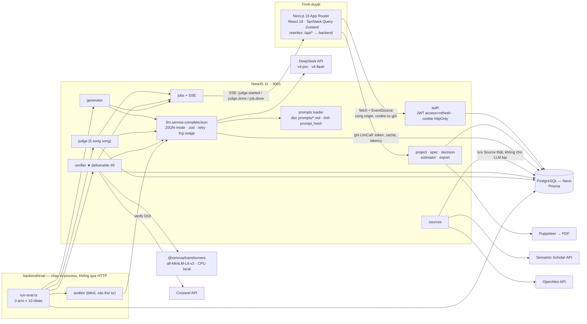
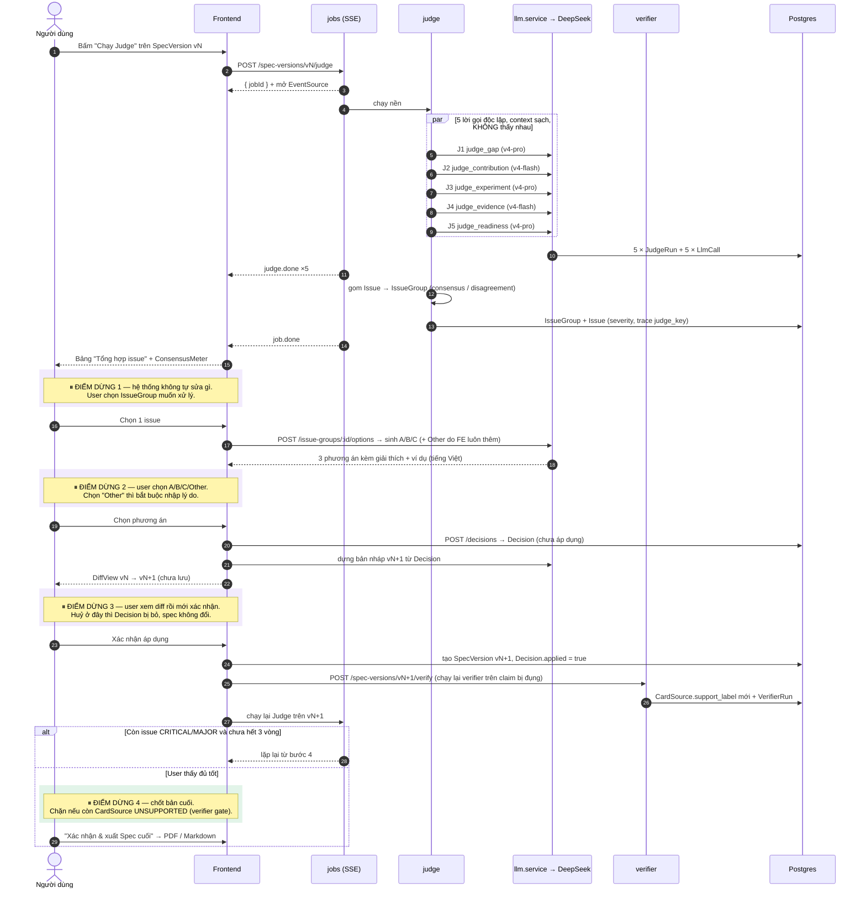
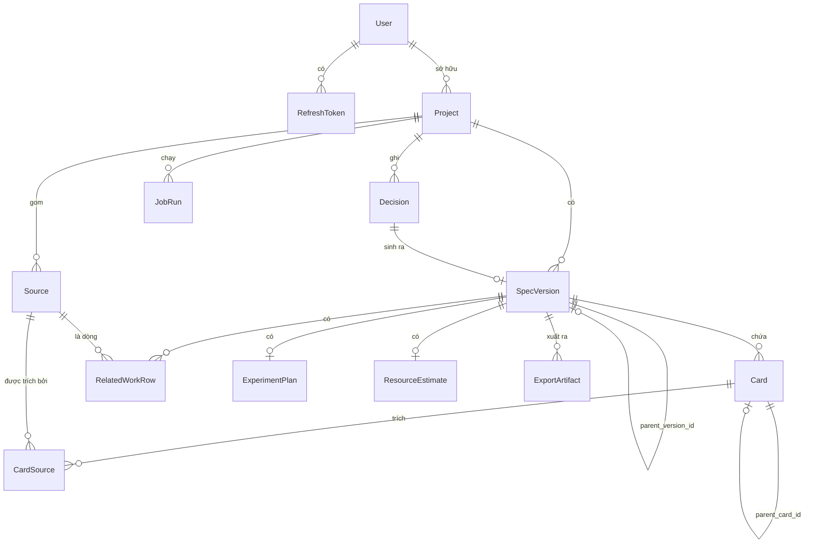
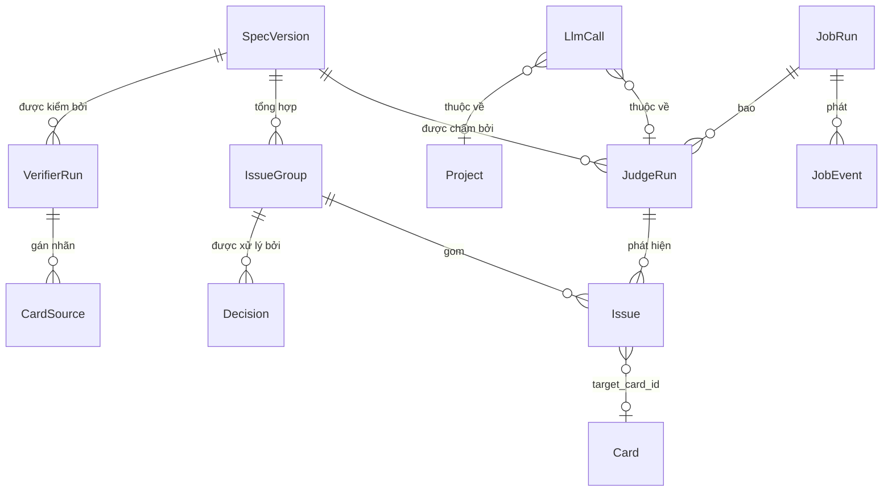
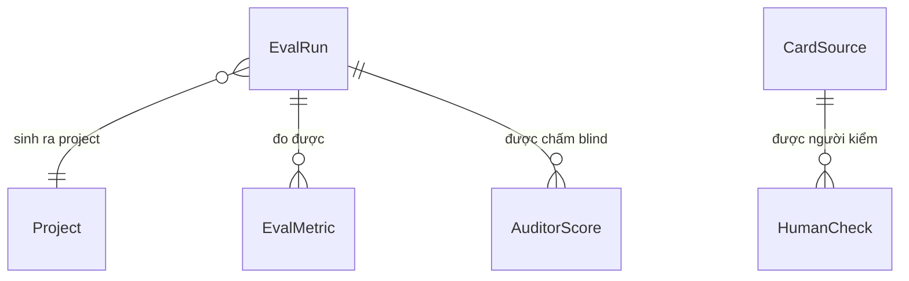
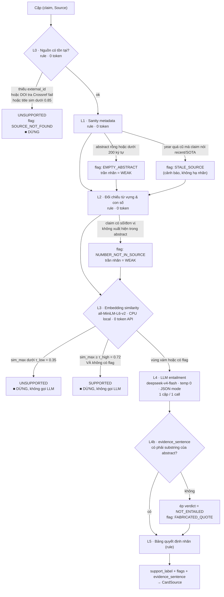
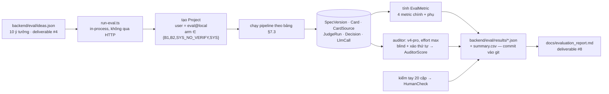

# ARCHITECTURE — SpecResearch Loop

Status: Draft — chờ verify
Ngày: 2026-08-16
Liên quan: `docs/SPECRESEARCH_LOOP-kim-chi-nam.md` (yêu cầu) · `docs/STACK.md` (công nghệ) ·
`docs/DESIGN_SYSTEM.md` (giao diện) · `.claude/rules/prompt-audit.md` (deliverable #5)

> **Đây là deliverable #3 của đề.** Mục tiêu: đủ để bắt đầu code mà không phải quyết thêm gì lớn.
>
> Quy ước đọc: **[QĐ]** = quyết định của tôi, đề bài không nói. Mọi [QĐ] đều có lý do kèm theo và
> phần lớn được nhắc lại ở §9 Open Questions nếu bạn có thể muốn quyết khác.
>
> Ranh giới tài liệu: *dùng công nghệ gì* → `STACK.md`. *Màu/chữ/component* → `DESIGN_SYSTEM.md`.
> File này giữ **dữ liệu, luồng, hợp đồng API, thuật toán verifier, thiết kế thí nghiệm**.

---

## 1. Sơ đồ hệ thống

### 1.1 Tổng thể — component & data flow

Ba điều đọc ra được từ sơ đồ, và đó là lý do nó được vẽ như vậy:

1. **Mọi lời gọi DeepSeek đi qua đúng một cửa** (`llm.service`). Đây là điều kiện để `usage` và
   `prompt_hash` luôn được ghi — dữ liệu bắt buộc cho báo cáo đánh giá (STACK §1.5).
2. **`Source` chỉ vào DB từ nhánh `sources`**, không có mũi tên nào từ `LLM` sang `Source`. Đó là
   cách kiến trúc chặn rủi ro #2 của đề (LLM bịa paper), chứ không phải bằng lời dặn trong prompt.
3. **`eval` gọi thẳng service**, không đi qua HTTP — nên 3 arm dùng chung đúng một đường ghi dữ liệu,
   không có nhánh code riêng cho baseline.

### 1.2 Vòng Judge — điểm dừng chờ người dùng nằm ở đâu

**Bốn điểm dừng, không có đường vòng nào bỏ qua chúng.** Đây là cách hệ thống thoả NFR
*human-in-the-loop* của đề ở mức kiểm chứng được: mỗi `SpecVersion` mới đều có `created_by_decision_id`
trỏ về một `Decision` do người dùng (hoặc `ScriptedDecisionPolicy` khi chạy eval) tạo ra. Không có
`Decision` thì không có version mới — ràng buộc này nằm ở tầng DB (NOT NULL từ v2 trở đi), không
phải ở tầng code.

**Giới hạn vòng lặp — [QĐ]:** tối đa **3 vòng judge** cho mỗi project. Đề nói "vòng lặp" nhưng không
nói dừng khi nào. 3 vòng là đủ để thấy issue giảm dần trong demo, và chặn được trường hợp eval chạy
vô hạn khi `ScriptedDecisionPolicy` chọn phương án không làm issue biến mất.

### 1.3 Máy trạng thái 5 bước — không bước nào tự chốt

```mermaid
stateDiagram-v2
  direction LR
  [*] --> S1
  S1: B1 · Nhập ý tưởng & Làm rõ
  S2: B2 · Nghiên cứu liên quan & Research Gap
  S3: B3 · Contribution & Kế hoạch thí nghiệm
  S4: B4 · Judge độc lập & Sửa spec
  S5: B5 · Spec cuối & Xuất bản
  DONE: FINAL (khoá, chỉ đọc)

  S1 --> S2: ⏸ user xác nhận diễn giải + trả lời câu hỏi làm rõ
  S2 --> S3: ⏸ user chọn hướng gap
  S3 --> S4: ⏸ user duyệt claim–evidence + kế hoạch thí nghiệm
  S4 --> S4: ⏸ vòng sửa (tối đa 3)
  S4 --> S5: ⏸ user chấp nhận bản spec
  S5 --> DONE: ⏸ user xác nhận và xuất — chặn bởi verifier gate
  S5 --> S4: quay lại chỉnh sửa thêm
  S2 --> S1: sửa lại ý tưởng
  S3 --> S2: tìm thêm nguồn
```

Mọi mũi tên tiến đều bắt đầu bằng ⏸ — không có cạnh nào do hệ thống tự đi.

---

## 2. Data model

### 2.1 ERD — lõi: sở hữu, thẻ, version, quyết định

### 2.2 ERD — judge, issue, verifier, job

### 2.3 ERD — đánh giá hệ thống (deliverable #4 · #7 · #8)

### 2.4 Bảng field

Quy ước: `PK` khoá chính · `FK` khoá ngoại · `U` unique · `IX` có index · `NN` not null.
Mọi bảng có `id uuid PK` và `created_at timestamptz NN default now()` — không lặp lại ở dưới.

#### User · RefreshToken

| Bảng.Field | Kiểu | Ràng buộc | Ghi chú |
|---|---|---|---|
| `User.email` | text | U, NN | |
| `User.password_hash` | text | NN | bcryptjs cost 10 (STACK §11.1) |
| `User.display_name` | text | NN | hiện ở `UserMenu` |
| `RefreshToken.user_id` | uuid | FK, IX | |
| `RefreshToken.token_hash` | text | NN | lưu **hash**, không lưu token — logout thu hồi được |
| `RefreshToken.expires_at` | timestamptz | NN | |
| `RefreshToken.revoked_at` | timestamptz | null | |

#### Project

| Field | Kiểu | Ràng buộc | Ghi chú |
|---|---|---|---|
| `user_id` | uuid | FK, IX, NN | **Mọi truy vấn scope theo field này**, lấy từ token (STACK §11.3) |
| `title` | text | NN | |
| `raw_idea` | text | NN | nguyên văn user nhập, tiếng Việt hoặc Anh |
| `domain` | text | null | do generator suy ra, dùng để nhóm khi báo cáo eval |
| `step` | enum | NN | `S1..S5` — bước stepper hiện tại |
| `status` | enum | NN | `DRAFT` \| `IN_PROGRESS` \| `FINAL` |
| `current_spec_version_id` | uuid | FK, null | con trỏ tiện đọc, **phi chuẩn hoá có chủ ý** — xem §2.5 |
| `arm` | enum | NN, default `SYS` | `B1` \| `B2` \| `SYS` — feature flag cho eval (§7) |
| `verifier_gate` | bool | NN, default `true` | tắt để chạy arm ablation `SYS−V` (§7) |
| `judge_round` | int | NN, default 0 | chặn vòng lặp ở 3 |

#### SpecVersion

| Field | Kiểu | Ràng buộc | Ghi chú |
|---|---|---|---|
| `project_id` | uuid | FK, IX, NN | |
| `version_no` | int | NN, U(project_id, version_no) | 1, 2, 3… |
| `parent_version_id` | uuid | FK, null | null đúng ở v1 |
| `created_by_decision_id` | uuid | FK, null | **NOT NULL về mặt nghiệp vụ từ v2** — không có quyết định của user thì không có version mới |
| `status` | enum | NN | `DRAFT` \| `UNDER_REVIEW` \| `ACCEPTED` \| `FINAL` |
| `label` | text | null | "sau vòng judge 1" — hiện trên `VersionTimeline` |

#### Card — 8 loại × 6 trạng thái (schema trung tâm)

| Field | Kiểu | Ràng buộc | Ghi chú |
|---|---|---|---|
| `spec_version_id` | uuid | FK, IX, NN | |
| `type` | enum | NN | `PROBLEM` `RESEARCH_QUESTION` `GAP` `CONTRIBUTION` `CLAIM` `EVIDENCE` `CONSTRAINT` `OPEN_QUESTION` |
| `status` | enum | NN | `CONFIRMED` `PROPOSED` `MISSING` `AMBIGUOUS` `UNSUPPORTED` `CONFLICT` |
| `title` | text | NN | tiếng Anh (STACK §10) |
| `body` | text | NN | tiếng Anh |
| `payload` | jsonb | null | trường riêng theo `type` — xem §2.5 |
| `order_index` | int | NN | thứ tự hiển thị |
| `parent_card_id` | uuid | FK, null | Evidence treo dưới Claim; thẻ sinh ra khi tách thẻ cũ |
| `origin` | enum | NN | `GENERATOR` \| `USER` \| `JUDGE_FIX` — phục vụ audit "ai viết dòng này" |
| `conflict_with_card_id` | uuid | FK, null | chỉ có nghĩa khi `status = CONFLICT`; cặp thẻ mâu thuẫn trỏ về nhau |

#### Source · CardSource · RelatedWorkRow

| Bảng.Field | Kiểu | Ràng buộc | Ghi chú |
|---|---|---|---|
| `Source.project_id` | uuid | FK, IX, NN | nguồn thuộc project, **không** thuộc version — tìm 1 lần dùng nhiều version |
| `Source.retrieved_from` | enum | NN | `SEMANTIC_SCHOLAR` \| `OPENALEX` \| `ARXIV` \| `CROSSREF`. **Không có giá trị `LLM`** — kiểu dữ liệu chặn rủi ro #2 |
| `Source.external_id` | text | NN, U(retrieved_from, external_id) | S2 paperId / OpenAlex id / arXiv id |
| `Source.title` `authors` `year` `venue` `doi` `url` `abstract` | text/jsonb/int | `doi` IX | `abstract` là đầu vào của verifier |
| `Source.citation_count` | int | null | tín hiệu độ tin cậy hiển thị ở `SourceChip` |
| `Source.raw` | jsonb | NN | nguyên văn response API — để chứng minh không bịa khi bảo vệ đồ án |
| `Source.retrieved_at` | timestamptz | NN | |
| `CardSource.card_id` `source_id` | uuid | FK, U(card_id, source_id) | |
| `CardSource.support_label` | enum | NN, default `WEAK` | `SUPPORTED` \| `WEAK` \| `UNSUPPORTED` ← **đầu ra của verifier** |
| `CardSource.similarity` | float | null | `sim_max` tầng L3 |
| `CardSource.entailment` | enum | null | `ENTAILS` \| `PARTIAL` \| `NOT_ENTAILED` \| `CONTRADICTS` |
| `CardSource.confidence` | float | null | |
| `CardSource.evidence_sentence` | text | null | câu trong abstract chống lưng claim — **bắt buộc là substring của abstract** (§6) |
| `CardSource.flags` | jsonb | null | `["NUMBER_NOT_IN_SOURCE","STALE_SOURCE","EMPTY_ABSTRACT"]` |
| `CardSource.verifier_run_id` | uuid | FK, null | nhãn này do lần chạy nào sinh ra |
| `RelatedWorkRow.spec_version_id` `source_id` | uuid | FK, NN | |
| `RelatedWorkRow.what_done` `feedback_type` `what_missing` | text | NN | 3 cột LLM sinh ra; cột "Nghiên cứu" và "Nguồn" lấy từ `Source` |

#### JudgeRun · Issue · IssueGroup

| Bảng.Field | Kiểu | Ràng buộc | Ghi chú |
|---|---|---|---|
| `JudgeRun.spec_version_id` | uuid | FK, IX, NN | |
| `JudgeRun.judge_key` | enum | NN, U(spec_version_id, judge_key, round) | `J1..J5` |
| `JudgeRun.round` | int | NN | vòng thứ mấy |
| `JudgeRun.model` `prompt_id` `prompt_hash` | text | NN | `prompt_hash` chứng minh prompt nộp = prompt chạy (deliverable #5) |
| `JudgeRun.input_digest` | text | NN | hash của `spec_json + sources_json` gửi cho judge — **bằng chứng 5 judge nhận đúng cùng input và không nhận output của nhau** |
| `JudgeRun.raw_output` | jsonb | NN | log riêng từng judge (NFR judge independence) |
| `JudgeRun.parse_attempts` | int | NN | lần 1 thành công ⇒ metric *JSON validity* |
| `JudgeRun.status` `error_code` | enum/text | NN/null | |
| `JudgeRun.job_id` | uuid | FK, null | |
| `Issue.judge_run_id` | uuid | FK, IX, NN | **trace về judge nào phát hiện** — yêu cầu tường minh của đề |
| `Issue.issue_group_id` | uuid | FK, IX, null | |
| `Issue.severity` | enum | NN | `CRITICAL` \| `MAJOR` \| `MINOR` |
| `Issue.title` `reason` `suggestion` | text | NN | đúng format `Vấn đề`/`Lý do`/`Đề xuất` của đề, nội dung tiếng Anh |
| `Issue.target_card_id` | uuid | FK, null | issue chỉ vào thẻ nào |
| `IssueGroup.spec_version_id` | uuid | FK, IX, NN | |
| `IssueGroup.canonical_title` | text | NN | tiêu đề đại diện sau khi gộp |
| `IssueGroup.max_severity` | enum | NN | mức nặng nhất trong nhóm |
| `IssueGroup.judge_keys` | jsonb | NN | `["J1","J3","J4"]` → pill trace trên UI |
| `IssueGroup.agreement_count` | int | NN | mấy/5 judge cùng nêu → **điểm đồng thuận** (chức năng 13) |
| `IssueGroup.disagreement_score` | float | NN | `1 − agreement_count/5`, dùng để sort "chỗ đáng ngờ nhất" |
| `IssueGroup.status` | enum | NN | `OPEN` \| `RESOLVED` \| `DISMISSED` |

#### Decision — chức năng 8 + mục 14 của spec

| Field | Kiểu | Ràng buộc | Ghi chú |
|---|---|---|---|
| `project_id` `spec_version_id` | uuid | FK, IX, NN | version **tại thời điểm hỏi** |
| `step` | enum | NN | `S1..S5` — quyết định thuộc bước nào |
| `issue_group_id` | uuid | FK, null | null nếu là câu hỏi làm rõ chứ không phải xử lý issue |
| `question` | text | NN | **tiếng Việt** (STACK §10) |
| `options` | jsonb | NN | `[{key,label,explain,example,recommended}]` — snapshot, không FK sang bảng khác |
| `chosen_key` | text | NN | `A` \| `B` \| `C` \| `OTHER` |
| `custom_text` | text | null | **NOT NULL về nghiệp vụ khi `chosen_key = OTHER`** |
| `actor` | enum | NN | `USER` \| `SCRIPTED` — phân biệt người thật và scripted user của eval |
| `applied` | bool | NN, default false | user xem diff rồi huỷ ⇒ vẫn giữ bản ghi, `applied=false` |
| `resulting_spec_version_id` | uuid | FK, null | version sinh ra sau khi áp dụng |

#### ExperimentPlan · ResourceEstimate · ExportArtifact

| Bảng.Field | Kiểu | Ràng buộc | Ghi chú |
|---|---|---|---|
| `ExperimentPlan.spec_version_id` | uuid | FK, U | 1–1 với version |
| `ExperimentPlan.plan` | jsonb | NN | `[{code:"TN1", title, bullets[], linked_claim_card_id}]` |
| `ResourceEstimate.spec_version_id` | uuid | FK, U | |
| `ResourceEstimate.inputs` | jsonb | NN | model size, quantization, candidates, rounds, eval samples |
| `ResourceEstimate.vram_gb` `hours_min` `hours_max` `tokens_est` `cost_usd` | float | NN | |
| `ResourceEstimate.fits_rtx3090` | bool | NN | ngưỡng 24GB, cảnh báo ở 20GB |
| `ResourceEstimate.downscale_suggestion` | jsonb | null | "giảm candidate 10→5" — đề yêu cầu tường minh |
| `ExportArtifact.spec_version_id` | uuid | FK, IX, NN | |
| `ExportArtifact.format` | enum | NN | `MD` \| `PDF` |
| `ExportArtifact.checksum` `byte_size` | text/int | NN | **không lưu blob** — file sinh lại được từ version, DB chỉ giữ chứng cứ đã xuất |

#### JobRun · JobEvent · LlmCall

| Bảng.Field | Kiểu | Ràng buộc | Ghi chú |
|---|---|---|---|
| `JobRun.project_id` `spec_version_id` | uuid | FK, IX | |
| `JobRun.kind` | enum | NN | `ANALYZE` \| `SEARCH` \| `RELATED_WORK` \| `GENERATE` \| `JUDGE` \| `VERIFY` \| `EXPORT` |
| `JobRun.status` | enum | NN | `QUEUED` \| `RUNNING` \| `DONE` \| `FAILED` |
| `JobRun.progress` | jsonb | NN | `{done: 3, total: 5}` |
| `JobEvent.job_id` `seq` | uuid/int | FK, U(job_id, seq) | **SSE replay**: F5 giữa chừng thì client gửi `Last-Event-ID`, server phát lại từ `seq` |
| `JobEvent.type` `payload` | text/jsonb | NN | `judge.started` \| `judge.done` \| `job.done` \| `job.failed` |
| `LlmCall.purpose` | enum | NN | `PARAPHRASE` `DECOMPOSE` `RELATED_WORK` `GAP` `CLAIM` `EXPERIMENT` `OPTIONS` `JUDGE` `ENTAILMENT` `AUDITOR` `B1_SINGLE_SHOT` |
| `LlmCall.model` `prompt_id` `prompt_hash` | text | NN | |
| `LlmCall.prompt_tokens` `completion_tokens` `cache_hit_tokens` `cache_miss_tokens` `latency_ms` `attempts` | int | NN | STACK §1.5 — **mọi** lời gọi, không ngoại lệ |
| `LlmCall.ok` `error_code` | bool/text | NN/null | |
| `LlmCall.project_id` `spec_version_id` `judge_run_id` `eval_run_id` | uuid | FK, null | ít nhất một cái non-null |

#### EvalRun · EvalMetric · AuditorScore · HumanCheck

| Bảng.Field | Kiểu | Ràng buộc | Ghi chú |
|---|---|---|---|
| `EvalRun.batch_id` | uuid | IX, NN | một lần chạy `run-eval.ts` = 1 batch = 30 `EvalRun` |
| `EvalRun.arm` | enum | NN | `B1` \| `B2` \| `SYS` \| `SYS_NO_VERIFY` |
| `EvalRun.idea_id` | text | NN | `I01..I10` từ `eval/ideas.json` (deliverable #4) |
| `EvalRun.project_id` | uuid | FK, NN | mọi arm đều tạo `Project` thật → so sánh trên cùng cấu trúc dữ liệu |
| `EvalRun.config` | jsonb | NN | model, temperature, ngưỡng verifier, `prompt_hash` của từng prompt |
| `EvalRun.total_tokens` `wall_ms` | int | NN | metric phụ §7.2 của đề |
| `EvalMetric.eval_run_id` `key` `value` | uuid/text/float | U(eval_run_id, key) | `citation_validity` `unsupported_rate` `completeness_14` `issues_major_critical` `json_validity` `l4_llm_ratio` |
| `AuditorScore.eval_run_id` | uuid | FK, NN | |
| `AuditorScore.blind_label` | text | NN | nhãn giả (`X`,`Y`,`Z`) đưa cho auditor — arm thật giấu đi |
| `AuditorScore.severity_counts` `raw` | jsonb | NN | |
| `HumanCheck.card_source_id` | uuid | FK, NN | 20 cặp (claim, nguồn) §7.5 của đề |
| `HumanCheck.human_label` `auto_label` | enum | NN | |
| `HumanCheck.match` | bool | NN | cột này cho ra con số "khớp 17/20 = 85%" |

### 2.5 Quyết định chuẩn hoá / phi chuẩn hoá

| Quyết định | Lý do | Phương án đã loại |
|---|---|---|
| **`Card.payload` là `jsonb`** thay vì bảng riêng cho `Gap` (4 câu hỏi) và `Claim` (5 trường) | 8 loại thẻ chỉ khác nhau ở vài trường phụ, chung 90% hành vi (status, version, nguồn, diff). Tách 8 bảng thì mọi truy vấn "lấy tất cả thẻ của version" thành 8 join. Đã có zod schema theo `type` ở `backend/src/contracts/card.ts` để bù tính an toàn kiểu | 8 bảng con (join nặng, diff phức tạp) · EAV key-value (không đọc nổi khi debug) |
| **`Source` thuộc `Project`, không thuộc `SpecVersion`** | Tìm nguồn tốn API quota và thời gian; version mới không được làm mất nguồn đã tìm. Quan hệ với version đi qua `CardSource` | Nguồn theo version → mỗi lần sửa spec phải copy toàn bộ nguồn |
| **`Card` copy sang version mới thay vì trỏ chung** | Version phải bất biến thì diff và audit mới có nghĩa. Chi phí: dữ liệu nhân lên theo số version — chấp nhận được vì tối đa ~5 version/project | Card trỏ vào version bằng khoảng `[from, to)` → diff phải tự dựng lại, dễ sai |
| **`Decision.options` là snapshot `jsonb`, không FK** | Câu hỏi và các phương án là **bằng chứng lịch sử**. Nếu prompt đổi ở tuần sau, bản ghi cũ vẫn phải đọc đúng những gì user đã thấy | Bảng `Option` riêng → sửa prompt là làm sai lệch decision history |
| **Không có bảng `SpecDiff`** | Diff là hàm thuần của 2 version, tính bằng `jsdiff` trong ~50ms. Lưu lại là phi chuẩn hoá không đổi lấy gì | Cache diff → thêm chỗ để dữ liệu lệch nhau |
| **`Project.current_spec_version_id` phi chuẩn hoá có chủ ý** | Màn hình nào cũng cần "version mới nhất"; không có nó thì mọi trang phải `ORDER BY version_no DESC LIMIT 1`. Cập nhật trong cùng transaction lúc tạo version | Luôn query max → n+1 query trên trang danh sách project |
| **`LlmCall` tách khỏi `JudgeRun`** | Không chỉ judge gọi LLM: generator, verifier, auditor, arm B1 cũng gọi. Bảng chung là nơi duy nhất tính được token/spec cho báo cáo | Nhét usage vào từng bảng nghiệp vụ → không tổng hợp nổi |
| **`IssueGroup` là bảng thật, không tính lúc đọc** | Gộp issue cần một lần gọi LLM (`OPTIONS`/gộp ngữ nghĩa) hoặc luật so khớp — không rẻ và **không deterministic**. `agreement_count` là số đi vào báo cáo, phải cố định | Gộp lúc render → mỗi lần F5 ra một kết quả khác |
| **`JudgeRun.input_digest`** | Đây là bằng chứng kỹ thuật cho ràng buộc "5 judge không thấy nhau": 5 run cùng `input_digest`, `raw_output` khác nhau, `started_at` trùng nhau | Chỉ nói suông trong báo cáo |
| **`EvalRun` tạo `Project` thật cho cả arm B1** | 3 arm cùng đi qua một đường ghi dữ liệu → script đo dùng chung một truy vấn. B1 chỉ có 1 `SpecVersion` với các `Card` do parse output single-shot | B1 ghi ra file JSON riêng → phải viết 2 bộ code đo, dễ so lệch |

### 2.6 10 deliverable → chỗ nào trong data model

Bảng để kiểm nhanh rằng không deliverable nào rơi ra ngoài schema.

| # | Deliverable | Chỗ trong hệ thống |
|---|---|---|
| 1 | Website chạy được | `frontend/` + `backend/` + README |
| 2 | Source code | repo Git |
| 3 | Tài liệu kiến trúc | **file này** |
| 4 | Dataset / tập use case | `backend/eval/ideas.json` → `EvalRun.idea_id` |
| 5 | Prompt Generator + 5 Judge | `prompts/*.md` → `JudgeRun.prompt_id` + `prompt_hash`, `LlmCall.prompt_hash` (chứng minh prompt nộp = prompt chạy) |
| 6 | Cơ chế kiểm tra citation/evidence | `verifier` module → `CardSource` (`support_label`, `similarity`, `entailment`, `evidence_sentence`, `flags`) + `VerifierRun` |
| 7 | ≥ 2 baseline | `Project.arm` + `EvalRun.arm` ∈ {`B1`, `B2`, `SYS`, `SYS_NO_VERIFY`} |
| 8 | Báo cáo đánh giá | `EvalMetric` + `AuditorScore` + `HumanCheck` + tổng hợp `LlmCall` (token, latency, cache) |
| 9 | Video demo | ngoài phạm vi data model |
| 10 | 1 research spec hoàn chỉnh | `SpecVersion.status = FINAL` → `ExportArtifact` (PDF + MD) |

---

## 3. 16 chức năng bắt buộc → module + màn hình

Màn hình: `S1..S5` = 5 bước wizard (`/projects/:id/step/N`) · `HOME` = `/` · `PROJ` = `/projects` ·
`VER` = `/projects/:id/versions` · `AUTH` = `/login`, `/register`.

| # | Chức năng (kim-chỉ-nam §3) | Module backend | Màn hình | Thành phần chính |
|---|---|---|---|---|
| 1 | Nhập ý tưởng nghiên cứu | `project` | `HOME`, `S1` | ô nhập + `Panel` "Ý tưởng ban đầu" |
| 2 | Diễn giải lại ý tưởng | `generator` (`PARAPHRASE`) | `S1` cột 2 | "Cách hệ thống đang hiểu ý tưởng" + `HintBox` mức chắc chắn |
| 3 | Phân rã problem/gap/claim/contribution/evidence | `generator` (`DECOMPOSE`) → `Card` 8 loại | `S1` → `S3` | `SpecCard` |
| 4 | Tìm kiếm & quản lý nguồn | `sources` (S2 → OpenAlex → Crossref) | `S2` cột 1 | `KeywordChipInput`, `SourceFilterList` |
| 5 | Tạo bảng related work | `sources` + `generator` (`RELATED_WORK`) | `S2` cột 2 | `RelatedWorkTable` |
| 6 | Phát hiện ambiguity & conflict | `generator` gán `AMBIGUOUS`/`CONFLICT`; `judge` J1/J2 phát hiện thêm | `S1`, `S2`, `S4` | `StatusChip`, `Card.conflict_with_card_id` |
| 7 | Lựa chọn có giải thích, ví dụ, **và "Other"** | `decision` (`OPTIONS`) | mọi bước, cột 3 | `OptionList` + `OptionHint` — FE **luôn** chèn `Other` |
| 8 | Lưu quyết định người dùng | `decision` → bảng `Decision` | mọi bước + `VER` | `DecisionLog` |
| 9 | Sinh kế hoạch thí nghiệm | `generator` (`EXPERIMENT`) → `ExperimentPlan` | `S3` cột 2 | `ExperimentPlanList` |
| 10 | Ước lượng tài nguyên | `estimator` (công thức, **không LLM**) | `S3` cột 3 | `StatTileGrid` + `EstimateRows` + cảnh báo giảm quy mô |
| 11 | Tạo research spec 14 mục | `spec` (dựng từ `Card` + `ExperimentPlan` + `ResourceEstimate`) | `S3`→`S5` | `SpecChecklist` |
| 12 | Chạy nhiều Judge độc lập | `judge` + `jobs` (SSE) | `S4` cột 2 | `JudgePanel`, `JudgeCard` |
| 13 | Tổng hợp đồng thuận / bất đồng | `judge` → `IssueGroup` | `S4` cột 2 | `IssueTable` + `ConsensusMeter` + `JudgeTracePill` |
| 14 | Cho người dùng quyết định sửa đổi | `decision` + `spec` | `S4` cột 3 | `OptionList` → `BeforeAfter` → `ConfirmDialog` |
| 15 | Quản lý version & hiển thị diff | `spec` (jsdiff) | `VER` | `VersionTimeline` + `DiffView` |
| 16 | Xuất bản spec cuối | `spec/export` (Markdown + Puppeteer PDF) | `S5` | `ExportBar` — **bị chặn bởi verifier gate** |

**Không có chức năng nào chưa có chỗ.** Ba thứ nằm ngoài 16 chức năng nhưng vẫn phải làm:

| Hạng mục | Vì sao có | Chỗ |
|---|---|---|
| Auth (đăng ký/đăng nhập/refresh/logout) | STACK §11 — có sở hữu dữ liệu thì mới có "dự án của tôi" | `auth` · `AUTH` |
| Citation verifier | Deliverable #6 + cơ chế mới của deliverable #8 | `verifier` · hiển thị ở `S2`, `S3`, `S5` |
| Trang "Trợ giúp" | Có trong nav của mockup nhưng **không** nằm trong 16 chức năng | **[QĐ]** trang tĩnh 1 màn — xem §9 |

---

## 4. 10 bước quy trình của đề → 5 bước stepper

**Cảnh báo trước khi đọc bảng:** đề mô tả rõ bước 2, 3, 4, 5, 6, 7, 9, 10. **Bước 1 và bước 8 là tái
dựng của tôi** từ ngữ cảnh (đề nhắc "nhập ý tưởng" và "tạo research spec" nhưng không đánh số).
Đánh dấu **[TD]** cho hai bước này.

| Bước của đề | Nội dung | → Bước UI | Vì sao gộp như vậy |
|---|---|---|---|
| 1 **[TD]** | Nhập ý tưởng thô | **B1** | Nhập rồi phải diễn giải ngay mới biết hệ thống hiểu đúng chưa — tách hai màn thì user bấm "tiếp" mà không có gì để xem |
| 2 | Phân rã 8 loại thẻ × 6 trạng thái + hỏi làm rõ | **B1** | |
| 3 | Bảng related work, mọi nhận định link nguồn | **B2** | Cùng một hoạt động: có nguồn mới rút ra được gap. Mockup 2 đã đặt chúng cạnh nhau trên một màn |
| 4 | Sinh gap trả lời được 4 câu hỏi | **B2** | |
| 5 | Claim–Evidence Card 5 trường | **B3** | Ba bước này là một mạch nhân quả: claim → thí nghiệm chứng minh claim → tài nguyên chạy thí nghiệm. Tách ra thì user phải nhớ claim khi xem estimate |
| 6 | Kế hoạch thí nghiệm + metric | **B3** | |
| 7 | Ước lượng tài nguyên + đề xuất giảm quy mô | **B3** | |
| 8 **[TD]** | Tổng hợp thành research spec 14 mục | **B4** | Spec 14 mục là **đầu vào** của judge, không phải một màn hình riêng. Hiện ở cột trái B4 ("Spec tạm thời" trong mockup 4) |
| 9 | 5 Judge độc lập + tổng hợp issue | **B4** | |
| 10 | Vòng sửa: lựa chọn → diff → verify lại → judge lại → xác nhận | **B4 ↔ B5** | **Cố ý tách đôi:** phần *vòng lặp* ở B4, phần *xác nhận & xuất bản* ở B5. Vì mockup 5 là một màn riêng và vì "chốt bản cuối" cần một điểm dừng sạch, không lẫn với đang-sửa |

Nhãn 5 bước trên UI (theo tiêu đề trang của mockup 1–4, xem `DESIGN_SYSTEM.md` §8 #1):

`1. Nhập ý tưởng & Làm rõ` · `2. Nghiên cứu liên quan & Research Gap` ·
`3. Contribution & Kế hoạch thí nghiệm` · `4. Judge độc lập & Sửa spec` · `5. Spec cuối`

---

## 5. API surface

Tiền tố: FE gọi `/api/*`, Next `rewrites()` chuyển sang `http://localhost:3001/*` (STACK §5).
Mọi endpoint (trừ `@Public()`) yêu cầu cookie access token. Lỗi trả `{ code, message, details? }`
với `code` thuộc enum `ErrorCode` (STACK §3.1 luật 3).

| Method | Path | Mô tả | Trả về |
|---|---|---|---|
| POST | `/auth/register` | Đăng ký email + password | `{ user }` + set 2 cookie |
| POST | `/auth/login` | Đăng nhập | `{ user }` + set 2 cookie |
| POST | `/auth/refresh` | Đổi refresh → access mới | set cookie |
| POST | `/auth/logout` | Thu hồi refresh token | `204` |
| GET | `/auth/me` | User hiện tại | `{ user }` |
| GET | `/health` | Healthcheck (`@Public()`) | `{ ok }` |
| POST | `/projects` | Tạo project từ ý tưởng thô | `{ project }` |
| GET | `/projects` | Danh sách project của tôi | `{ projects[] }` |
| GET | `/projects/:id` | Chi tiết + version hiện tại | `{ project, currentVersion }` |
| PATCH | `/projects/:id` | Sửa tiêu đề, `step` | `{ project }` |
| DELETE | `/projects/:id` | Xoá | `204` |
| POST | `/projects/:id/analyze` | **B1**: paraphrase + phân rã thẻ + câu hỏi làm rõ | `{ jobId }` |
| POST | `/projects/:id/sources/search` | **B2**: tìm nguồn thật (S2 → OpenAlex) | `{ jobId }` |
| GET | `/projects/:id/sources` | Nguồn đã gom | `{ sources[] }` |
| POST | `/projects/:id/related-work` | Sinh bảng related work từ nguồn đã có | `{ jobId }` |
| POST | `/projects/:id/gap` | Sinh gap trả lời 4 câu hỏi | `{ jobId }` |
| POST | `/projects/:id/contributions` | **B3**: sinh contribution + claim–evidence | `{ jobId }` |
| POST | `/projects/:id/experiment-plan` | Sinh kế hoạch thí nghiệm | `{ jobId }` |
| POST | `/projects/:id/estimate` | Ước lượng tài nguyên (**không LLM**) | `{ estimate }` |
| GET | `/spec-versions/:id` | Version + 14 mục đã dựng | `{ version, sections[] }` |
| GET | `/spec-versions/:id/cards` | Thẻ theo `type`, `status` | `{ cards[] }` |
| PATCH | `/cards/:id` | User sửa tay 1 thẻ | `{ card }` |
| GET | `/projects/:id/versions` | Lịch sử version | `{ versions[] }` |
| GET | `/spec-versions/:id/diff` | Diff với `?against=<versionId>` | `{ hunks[] }` |
| POST | `/spec-versions/:id/judge` | **B4**: chạy 5 judge song song | `{ jobId }` |
| GET | `/spec-versions/:id/judge-runs` | Log riêng từng judge (bằng chứng độc lập) | `{ runs[] }` |
| GET | `/spec-versions/:id/issues` | Issue đã gộp thành `IssueGroup` | `{ groups[] }` |
| POST | `/issue-groups/:id/options` | Sinh A/B/C cho 1 issue | `{ options[] }` |
| POST | `/spec-versions/:id/verify` | Chạy citation verifier | `{ jobId }` |
| GET | `/spec-versions/:id/verification` | Nhãn support từng cặp (claim, nguồn) | `{ pairs[], summary }` |
| POST | `/decisions` | Lưu lựa chọn của user (chưa áp dụng) | `{ decision, preview }` |
| POST | `/decisions/:id/apply` | Áp dụng → tạo `SpecVersion` mới | `{ version }` |
| GET | `/projects/:id/decisions` | Decision history (mục 14 của spec) | `{ decisions[] }` |
| POST | `/spec-versions/:id/export` | `?format=md\|pdf` | `{ artifactId }` hoặc `409 EXPORT_BLOCKED_UNSUPPORTED_CITATION` |
| GET | `/spec-versions/:id/export/:artifactId` | Tải file | file |
| GET | `/jobs/:id` | Trạng thái job | `{ job }` |
| GET | `/jobs/:id/stream` | **SSE** — hỗ trợ `Last-Event-ID` | `text/event-stream` |

**Quy ước xuyên suốt, không lặp lại ở từng dòng:**

- Endpoint nào gọi LLM đều trả `{ jobId }` chứ không chờ đồng bộ → FE mở `EventSource` (STACK §5).
  Ngoại lệ duy nhất: `/estimate` (thuần công thức) và `/decisions` (chỉ ghi DB).
- Mọi truy vấn kèm `where: { user_id }` từ token; hỏi tài nguyên của người khác trả **404** không
  phải 403 (STACK §11.3).
- Không có endpoint nào nhận `owner_id`/`user_id` từ body hay query.

---

## 6. ★ Citation Verifier — cơ chế mới (deliverable #6 + #8)

Phần được thiết kế kỹ nhất trong tài liệu này, vì nó vừa là deliverable bắt buộc #6, vừa là
"cơ chế mới" để chứng minh bằng số ở deliverable #8.

### 6.1 Vấn đề và mục tiêu

Hệ thống sinh ra claim tiếng Anh và gắn nguồn vào từng claim. Hai kiểu sai xảy ra, khác nhau về bản
chất:

| Kiểu sai | Ví dụ | Ai bắt được |
|---|---|---|
| **Nguồn không tồn tại** | LLM trích "Smith et al., 2023, *Prompt Distillation*" — không có paper nào như vậy | Rule, 0 token |
| **Nguồn có thật nhưng không nói điều claim nói** | Trích đúng OPRO nhưng gán cho nó con số "giảm 20% unsupported claims" mà paper không hề có | Cần đọc abstract |

**Mục tiêu đo được:** hạ `unsupported claim rate` của SYS xuống dưới B2 và B1, với chi phí LLM cho
việc kiểm tra **dưới 15%** tổng token của một spec. Con số thứ hai quan trọng ngang con số thứ nhất:
nếu verifier tốn bằng cả pipeline thì nó không phải một cải tiến, chỉ là một cách tiêu tiền.

### 6.2 Đầu vào / đầu ra

**Đầu vào:** một `SpecVersion`. Lấy mọi `CardSource` mà `Card.type ∈ {CLAIM, GAP, CONTRIBUTION, EVIDENCE}`.
Mỗi cặp `(claim_text, Source)` là một **verification unit**.

**Đầu ra mỗi unit:** ghi vào `CardSource` — `support_label`, `similarity`, `entailment`, `confidence`,
`evidence_sentence`, `flags[]`. Một `VerifierRun` ghi tổng: số unit, phân bố nhãn, tỉ lệ phải dùng
LLM, ngưỡng đã dùng.

**Hiệu ứng phụ lên `Card`:** thẻ có **mọi** nguồn `UNSUPPORTED` → `Card.status = UNSUPPORTED`.
Verifier **không sửa nội dung thẻ** — nó chỉ gắn nhãn. Sửa là việc của user qua `Decision`.

### 6.3 Thuật toán — 5 tầng, rẻ trước đắt sau

**Vì sao xếp tầng như vậy:** ba tầng đầu chặn được phần lớn lỗi mà **không tốn một token API nào**.
LLM chỉ chạm vào vùng xám. Đây chính là điều biến verifier thành một cải tiến đáng viết vào báo cáo
thay vì "gọi thêm một LLM nữa để kiểm tra LLM".

### 6.4 Chi tiết từng tầng

| Tầng | Rule hay LLM | Đầu vào | Đầu ra | Chi phí |
|---|---|---|---|---|
| **L0** Existence | **Rule** + HTTP | `Source.doi`, `external_id`, `retrieved_from` | pass / `SOURCE_NOT_FOUND` | 1 request Crossref, cache theo DOI |
| **L1** Metadata sanity | **Rule** | `year`, `abstract`, `venue`, `authors` | flags | 0 |
| **L2** Lexical & numeric guard | **Rule** | claim, `title + abstract` | `jaccard_terms`, flags | 0 |
| **L3** Embedding | **Local model** | claim, câu trong abstract | `sim_max`, `sim_top3` | CPU, ~30ms/cặp |
| **L4** Entailment | **LLM** | claim + abstract + 3 câu sim cao nhất | verdict, confidence, evidence_sentence | ~700 token/cặp |
| **L4b** Chống bịa trích dẫn | **Rule** | `evidence_sentence` vs abstract | ép `NOT_ENTAILED` nếu không phải substring | 0 |
| **L5** Quyết định | **Rule** | tất cả ở trên | `support_label` | 0 |

**L0 — cách so title (deterministic):** normalize (lowercase, bỏ dấu câu, bỏ stopword), tính
token-set ratio. `≥ 0.85` là cùng một paper. Ngưỡng cao vì đây là cửa chặn cứng — thà bỏ sót một
nguồn thật còn hơn cho lọt một nguồn bịa.

**L2 — numeric guard, luật quan trọng nhất của tầng rule:** trích mọi số kèm đơn vị trong claim
(`20%`, `1.8×`, `24GB`, `F1 0.87`, `p < 0.05`) và mọi tên riêng viết hoa. Số nào không xuất hiện
trong abstract (cho phép sai số làm tròn 1 chữ số) → `NUMBER_NOT_IN_SOURCE`, **trần nhãn hạ xuống
`WEAK` bất kể L3 và L4 nói gì**. Lý do: dạng hallucination hay gặp nhất không phải bịa cả paper, mà
là trích đúng paper rồi gán cho nó một con số không có. Embedding không bắt được kiểu này — hai câu
chỉ khác con số có cosine rất cao.

**L3 — embedding:** `all-MiniLM-L6-v2` qua `@xenova/transformers`, chạy CPU local (STACK §2.7 — bắt
buộc, DeepSeek không có embedding API). Abstract tách câu bằng regex, embed từng câu, `sim_max` là
cosine lớn nhất. So **theo câu** chứ không so cả abstract: một abstract 8 câu bàn 3 ý, embed cả cụm
thì tín hiệu của câu đúng bị pha loãng. Model chạy local nên hoàn toàn deterministic → thoả NFR
reproducibility, và chạy lại eval cho ra đúng con số cũ.

**L4 — prompt entailment:** file **`prompts/verifier_entailment.md`** — **[QĐ]** file thứ 8, ngoài 6
file bắt buộc, cùng loại với `auditor.md` mà STACK §3 đã chừa chỗ.

- Model `deepseek-v4-flash`, `temperature: 0`, `reasoning_effort: low`, `response_format: json_object`.
- Input **chỉ** gồm claim + abstract + 3 câu top. Prompt nêu rõ: *chỉ dùng abstract được cung cấp,
  cấm dùng kiến thức có sẵn về paper này*. Không đưa title tác giả nổi tiếng vào phần suy luận để
  tránh model gật đầu vì danh tiếng.
- Output: `{ verdict: ENTAILS|PARTIAL|NOT_ENTAILED|CONTRADICTS, confidence: 0..1, evidence_sentence: string|null, reason: string }`

**L4b — chống bịa trích dẫn:** `evidence_sentence` phải là substring (sau khi normalize khoảng
trắng) của abstract. Không phải → verdict bị ép `NOT_ENTAILED` + flag `FABRICATED_QUOTE`. Đây là chỗ
**rule kiểm tra output của LLM**, không phải LLM tự chấm mình — và tỉ lệ `FABRICATED_QUOTE` là một
con số thú vị để đưa vào báo cáo.

### 6.5 Bảng quyết định nhãn (L5)

Áp dụng từ trên xuống, luật đầu tiên khớp thì dừng.

| # | Điều kiện | Nhãn |
|---|---|---|
| 1 | L0 fail | `UNSUPPORTED` |
| 2 | `sim_max < τ_low` | `UNSUPPORTED` |
| 3 | `verdict = CONTRADICTS` | `UNSUPPORTED` |
| 4 | `verdict = NOT_ENTAILED` | `UNSUPPORTED` |
| 5 | có flag `NUMBER_NOT_IN_SOURCE` hoặc `EMPTY_ABSTRACT` | `WEAK` (trần) |
| 6 | `verdict = PARTIAL` | `WEAK` |
| 7 | `verdict = ENTAILS` và `confidence < 0.70` | `WEAK` |
| 8 | `verdict = ENTAILS` và `confidence ≥ 0.70` | `SUPPORTED` |
| 9 | bỏ qua L4 vì `sim_max ≥ τ_high` và không flag | `SUPPORTED` |

Ngưỡng khởi điểm `τ_low = 0.35`, `τ_high = 0.72`, `conf_min = 0.70` — **đây là ước đoán, không phải
số đo**. Chúng nằm ở `backend/src/verifier/thresholds.ts` và được **copy vào `VerifierRun.config`
mỗi lần chạy**, để mọi nhãn cũ vẫn giải thích được sau khi ngưỡng đổi.

**Cách hiệu chỉnh (làm ở cuối phase 2):** dùng đúng 20 cặp human-labeled của §7.5 đề bài, grid search
`τ_low ∈ {0.30, 0.35, 0.40} × τ_high ∈ {0.68, 0.72, 0.76}`, chọn cặp cho agreement cao nhất, tie-break
bằng cặp nào dùng ít LLM hơn. Ghi bảng grid vào `docs/evaluation_report.md` — nó biến ngưỡng từ "số
tôi chọn" thành "số tôi đo".

### 6.6 Verifier gate — chỗ verifier thật sự thay đổi hành vi hệ thống

Gắn nhãn thôi thì chưa phải cơ chế; **chặn** mới là cơ chế.

`POST /spec-versions/:id/export` trả `409 EXPORT_BLOCKED_UNSUPPORTED_CITATION` kèm danh sách cặp,
khi còn `CardSource.support_label = UNSUPPORTED` trên card `CLAIM`/`GAP`/`CONTRIBUTION`.
(`EVIDENCE` không chặn vì thẻ evidence bị bác chính là thông tin có ích, giữ lại trong spec.)

User có 4 đường ra, **mỗi đường ghi một `Decision`** — hệ thống không tự sửa gì:

| Option | Hành động |
|---|---|
| A | Đổi nguồn khác (mở lại tìm kiếm cho đúng claim đó) |
| B | Sửa claim cho khớp điều evidence thật sự nói |
| C | Hạ claim xuống `OPEN_QUESTION` (giữ ý tưởng, bỏ khẳng định) |
| Other | Giữ nguyên + **bắt buộc nhập lý do**; claim được đánh dấu trong spec xuất ra |

Đường "Other" tồn tại vì NFR human-in-the-loop: người dùng vẫn là người quyết định cuối cùng. Nhưng
nó để lại vết trong `Decision.custom_text` và trong file xuất ra — đó là sự khác nhau giữa
*bỏ qua có ghi nhận* và *không kiểm tra*.

### 6.7 Metric chứng minh verifier có tác dụng

| # | Metric | Công thức | Chứng minh điều gì |
|---|---|---|---|
| 1 | **Citation validity %** | `#unit qua L0 / #unit` | Nguồn có thật không. Deterministic, 0 LLM. B1 sẽ rất thấp — delta không cãi được |
| 2 | **Unsupported claim rate %** | `#unit nhãn UNSUPPORTED / #unit` | Đúng trọng tâm "giảm claim không có bằng chứng ↓" của đề |
| 3 | **Human agreement** | accuracy + confusion matrix 3×3 + Cohen's κ trên 20 cặp | Biến metric tự động từ *"LLM nói vậy"* thành *"có validate"* (§7.5 đề) |
| 4 | **Chi phí kiểm tra** | `#unit xuống L4 / #unit` và `token verifier / token spec` | Chứng minh thiết kế "rule trước, LLM sau" là rẻ — mục tiêu < 15% |
| 5 | **Δ theo vòng** | unsupported rate ở vòng 1 vs vòng cuối, trong cùng project | Chứng minh **vòng lặp** có tác dụng, không chỉ lần kiểm đầu |
| 6 | **Ablation SYS vs SYS−V** | cùng 10 ideas, chỉ khác `verifier_gate` | **Bằng chứng nhân quả mạnh nhất**: verifier gate giảm được bao nhiêu % |
| 7 | **Fabricated-quote rate** | `#unit có flag FABRICATED_QUOTE / #unit xuống L4` | Con số phụ nhưng thuyết phục: LLM bịa cả câu trích ở tỉ lệ nào |

Metric 1–2 chạy được trên **cả 3 arm** vì verifier chạy ở chế độ *chỉ đo* cho B1/B2 (§7.3).
Metric 6 là arm ablation thứ tư.

### 6.8 Phương án đã cân nhắc và loại

| Phương án | Vì sao loại |
|---|---|
| Chỉ dùng LLM entailment cho mọi cặp | Đắt, chậm, và không deterministic — mất luôn NFR reproducibility. Cũng không bắt được lỗi "paper không tồn tại" tốt hơn rule |
| Chỉ dùng embedding, bỏ LLM | Không phân biệt được *entail* với *cùng chủ đề*. Hai câu ngược nghĩa nhau vẫn có cosine cao |
| Full-text thay vì abstract | Phần lớn paper không có full text miễn phí; đường ống trở nên phụ thuộc PDF parsing. Ngoài phạm vi MVP |
| Cross-encoder NLI (deberta-mnli) qua `@xenova/transformers` | Chính xác hơn bi-encoder nhưng model nặng hơn nhiều và chậm trên CPU; và ta đã có LLM cho tầng đó. Ghi vào Open Questions phòng khi có thời gian |
| Verifier **tự sửa** claim cho khớp evidence | Vi phạm trực tiếp NFR "không bước nào tự động chốt" của đề |

### 6.9 Rủi ro của thiết kế này

| Rủi ro | Ảnh hưởng | Giảm thiểu |
|---|---|---|
| 20 cặp human-label là quá ít để hiệu chỉnh 3 ngưỡng | Ngưỡng overfit vào 20 cặp | Grid thô (3×3), không tinh chỉnh sâu; ghi thẳng là limitation trong báo cáo |
| Model embedding chỉ tiếng Anh | Claim tiếng Việt sẽ cho similarity nhiễu | Đã chặn từ gốc: spec bắt buộc tiếng Anh (STACK §10) |
| Semantic Scholar rate-limit khi chạy eval 30 lượt | Eval fail giữa chừng | Cache `Source` theo `(retrieved_from, external_id)`; fallback OpenAlex; `SEMANTIC_SCHOLAR_API_KEY` nếu có |
| Verifier gate chặn quá tay làm demo tắc | Không xuất được spec để quay video | Đường "Other" luôn có, và `verifier_gate` tắt được ở cấp project |

---

## 7. Thiết kế cho eval 3 arm (deliverable #7 + #8)

### 7.1 Các arm

| Arm | Là gì | Đo được điều gì |
|---|---|---|
| `B1` | Single-shot: 1 prompt → spec 14 mục. Không search, không phân rã, không judge | Sàn dưới |
| `B2` | Pipeline đầy đủ **trừ vòng judge**. Dừng sau spec tạm thời | B1→B2 = đóng góp của *retrieval + phân rã có cấu trúc* |
| `SYS` | Hệ đầy đủ: 5 judge + vòng sửa + verifier gate | B2→SYS = đóng góp của *vòng judge* |
| `SYS_NO_VERIFY` **[QĐ]** | `SYS` nhưng `verifier_gate = false` | SYS−V→SYS = đóng góp của *citation verifier* — cơ chế mới của ta |

Đề đòi **ít nhất hai** baseline; ta có B1 và B2. `SYS_NO_VERIFY` là **arm ablation bổ sung**, không
thay thế hai baseline kia — nếu thiếu thời gian thì bỏ nó cuối cùng. Nhưng nó là bảng số duy nhất
trả lời trực tiếp *"cơ chế mới của bạn có tác dụng không"*, nên xếp ưu tiên cao.

### 7.2 Feature flag đặt ở đâu

**Ở `Project.arm` + `Project.verifier_gate`, không phải biến môi trường.** STACK §9 gọi nó là feature
flag `SKIP_JUDGE`; đây là cùng một ý, đặt ở cấp bản ghi thay vì cấp process.

Lý do: env var nghĩa là muốn chạy 3 arm phải khởi động lại app 3 lần, và dữ liệu 3 arm nằm ở 3 lần
chạy khác nhau — vừa chậm vừa khó so. Đặt ở `Project` thì một lần `run-eval.ts` sinh cả 30 project,
cùng một process, cùng một ngày, cùng một `prompt_hash`, và mọi truy vấn tổng hợp là một câu SQL.
`SKIP_JUDGE` trở thành thuộc tính suy ra: `arm !== 'SYS' && arm !== 'SYS_NO_VERIFY'`.

### 7.3 Giai đoạn nào chạy ở arm nào

| Giai đoạn pipeline | B1 | B2 | SYS_NO_VERIFY | SYS |
|---|---|---|---|---|
| Paraphrase + phân rã 8 loại thẻ | ✗ | ✓ | ✓ | ✓ |
| Tìm nguồn thật (S2/OpenAlex) | ✗ | ✓ | ✓ | ✓ |
| Bảng related work | ✗ | ✓ | ✓ | ✓ |
| Gap 4 câu hỏi | ✗ | ✓ | ✓ | ✓ |
| Claim–Evidence 5 trường | ✗ | ✓ | ✓ | ✓ |
| Experiment plan + resource estimate | ✗ | ✓ | ✓ | ✓ |
| Verifier — **chế độ đo** (gắn nhãn, không chặn) | ✓ | ✓ | ✓ | ✓ |
| Verifier — **chế độ chặn** (gate + sinh option sửa) | ✗ | ✗ | ✗ | ✓ |
| 5 judge song song | ✗ | ✗ | ✓ | ✓ |
| Vòng sửa + version + diff | ✗ | ✗ | ✓ | ✓ |

**Điểm mấu chốt — [QĐ]:** verifier có **hai vai tách rời**: *đo* và *can thiệp*.

- Vai **đo** chạy cho **mọi arm**, kể cả B1. Đó là cách duy nhất tính được `citation_validity` và
  `unsupported_rate` cho baseline — không thể so B1 với SYS nếu B1 không được đo bằng cùng thước.
  Vai này chỉ ghi `CardSource`, không đổi hành vi pipeline.
- Vai **can thiệp** (chặn export + đẩy user vào vòng sửa) chỉ có ở `SYS`. Đây mới là "cơ chế".

Nhờ tách vậy, so sánh mới công bằng: cùng một thước đo áp cho cả 4 arm, chỉ khác ở việc arm nào
*hành động* theo kết quả đo.

### 7.4 Scripted user

App là human-in-the-loop; thí nghiệm cần lặp lại được. Giải: `decision` module định nghĩa một
interface `DecisionPolicy` với hai hiện thực.

| Hiện thực | Dùng khi | Hành vi |
|---|---|---|
| `HumanDecisionPolicy` | app chạy thật | Tạo `Decision` với `chosen_key` rỗng, trả về FE, **chờ** user `POST /decisions`. `actor = USER` |
| `ScriptedDecisionPolicy` | `run-eval.ts` | Chọn option có `recommended = true`; không có thì chọn `A`. **Không bao giờ chọn `Other`**. `actor = SCRIPTED` |

Ba tính chất khiến 3 arm chạy công bằng:

1. **Cùng một policy cho cả 4 arm** — không arm nào được "user thông minh hơn".
2. **Deterministic** — không random, không LLM; chạy lại ra đúng chuỗi quyết định cũ.
3. **Đi qua đúng đường ghi của app thật** — vẫn tạo `Decision`, vẫn tạo `SpecVersion`. Không có
   nhánh code tắt riêng cho eval, nên không có chuyện "eval chạy một đằng, app chạy một nẻo".

**Limitation phải ghi vào báo cáo:** scripted user luôn chọn phương án hệ thống gợi ý, nên kết quả
là **cận trên** của những gì đạt được khi user hợp tác hoàn toàn — người thật có thể chọn tệ hơn.
Đề §7.3② yêu cầu ghi rõ điều này.

### 7.5 Dữ liệu eval đi vào đâu

**Điều kiện công bằng (đề §7.3③):** cùng base model theo vai, `temperature: 0` mọi lời gọi, cùng
`batch_id` = cùng một lần chạy, cùng ngày. Ghi `prompt_hash` của từng prompt vào `EvalRun.config`.

**[QĐ] về seed:** DeepSeek API **không có tham số `seed`**. Cái tái lập được là `temperature: 0` +
prompt cố định + `prompt_hash` ghi lại. Đề §7.3③ nói "cùng seed" — điều kiện này **không thoả được
đầy đủ** với provider hiện tại; phải ghi thành limitation trong báo cáo, không được lờ đi.

**Auditor:** `prompts/auditor.md`, `deepseek-v4-pro`, `reasoning_effort: max` — khác tier với 5 judge
(STACK §2.6 lớp 1), prompt viết độc lập (lớp 2), chấm blind + xáo thứ tự (lớp 3), human validation
20 cặp (lớp 4). Vì MVP chỉ có một nhà cung cấp, cả 4 lớp là bắt buộc và cả 4 phải được ghi thành
limitation.

---

## 8. Kế hoạch triển khai

Bám đúng thứ tự STACK §9 / kim-chỉ-nam §9. Cột "coi là xong" là điều **quan sát được**, không phải
"đã viết code".

| # | Phase | % | Coi là xong khi |
|---|---|---|---|
| 0 | Setup | — | `DESIGN_SYSTEM.md` + file này được duyệt · 6 file `prompts/` có frontmatter hợp lệ · `backend/src/contracts/` khớp Prisma enum · `prisma migrate` chạy được trên Neon · FE dựng được `TopNav` + `Stepper` + `StepperCompact` với token ở `DESIGN_SYSTEM.md` §2 · **`WizardShell` đã có đủ 3 tầng bố cục và `DecisionSheet` rỗng chạy được ở 375px** |
| 0.5 | Auth | — | Đăng ký → đăng nhập → F5 vẫn đăng nhập → logout thu hồi được · user A gọi `GET /projects/:id` của user B nhận **404** |
| 1 | Xương sống | 15% | Nhập ý tưởng → thấy paraphrase → thấy thẻ 8 loại có `StatusChip` → trả lời 1 câu hỏi làm rõ → `Decision` xuất hiện trong DB với `actor = USER` |
| 2 | Grounding | 20% | `RelatedWorkTable` hiển thị ≥ 5 nguồn **có DOI tra Crossref ra thật** · mỗi claim có ≥ 1 `CardSource` mang `SupportTag` · ngưỡng verifier đã hiệu chỉnh trên 20 cặp và bảng grid nằm trong repo |
| 3 | Nội dung spec | 20% | Gap hiển thị đủ 4 câu trả lời · `ClaimEvidenceCard` có đủ 5 trường (**kiểm riêng trường "Điều kiện bác bỏ"**) · `ExperimentPlanList` ≥ 3 TN · estimator ra VRAM/thời gian/token và **hiện đề xuất giảm quy mô** khi vượt |
| 4 | Judge loop | 20% | 5 `JudgeRun` cùng `input_digest`, khác `raw_output`, `started_at` chênh < 1s · `IssueTable` có severity + pill trace · chọn 1 option → thấy `DiffView` → xác nhận → `SpecVersion` v2 ra đời với `created_by_decision_id` non-null |
| 5 | Export + UI | 5% | Xuất **cả** PDF và Markdown từ cùng một version · thử xuất khi còn 1 claim `UNSUPPORTED` → nhận `409` và thấy 4 lựa chọn xử lý · **đi hết 5 bước ở 375px, 768px và 1440px, qua đủ checklist `DESIGN_SYSTEM.md` §6.10** |
| 6 | Đánh giá | 15% | `run-eval.ts` chạy 10 ideas × 4 arm một mạch không lỗi · `results/summary.csv` có mean ± std của 4 metric chính · `HumanCheck` đủ 20 dòng · `evaluation_report.md` có bảng 3 arm + biểu đồ cột + mục limitation |
| 7 | Video + docs | 5% | File này được cập nhật khớp code thật (ERD, endpoint, ngưỡng) · video demo đi hết 5 bước và **chỉ ra được điểm dừng chờ người dùng** · 1 sample spec xuất PDF |

**Luật không đổi:** không sang phase sau khi phase trước chưa chạy end-to-end. Hai chỗ dễ vi phạm
nhất: (a) làm UI đẹp ở phase 1 trước khi có dữ liệu thật, (b) hoãn phase 6 tới cuối — mà phase 6
chính là mảng lớn nhất của điểm số (kim-chỉ-nam §11 rủi ro #1).

**Responsive không phải việc của phase 5.** Phase 5 chỉ *nghiệm thu* nó. Khung ba tầng bố cục và
`DecisionSheet` phải đứng từ **phase 0**, vì mọi màn hình dựng sau đều nằm trong khung đó — bọc mobile
lên một UI đã viết chết theo 3 cột thì phải viết lại, không phải chỉnh. Cụ thể: mỗi phase 1–4 khi
xong một bước wizard thì bước đó đã phải chạy được ở 375px, không nợ sang sau.

---

## 9. Open Questions

Những chỗ tôi phải đoán. Mỗi dòng ghi rõ đoán gì và ai trả lời được.

| # | Câu hỏi | Tôi đã tạm quyết | Ai trả lời |
|---|---|---|---|
| 1 | Mục 7 của đề bị thiếu (nhiều khả năng là rubric) | Thiết kế theo 16 chức năng + 10 deliverable | **Giảng viên** |
| 2 | Video demo: độ dài, format, có voice-over không | Chưa quyết | **Giảng viên** |
| 3 | "Ít nhất hai baseline" hiểu là B1 + B2 (hệ đối chứng) chứ không phải baseline trong nội dung spec | Theo cách hiểu ở kim-chỉ-nam §6 | **Giảng viên** |
| 4 | Bước 1 và bước 8 của "10 bước" là tái dựng của tôi (§4 **[TD]**) | Bước 1 = nhập ý tưởng, bước 8 = tổng hợp spec 14 mục | **Giảng viên** |
| 5 | `prompts/verifier_entailment.md` là file thứ 8 ngoài 6 file bắt buộc của deliverable #5 | Thêm, cùng loại với `auditor.md` | **Bạn** |
| 6 | Arm thứ 4 `SYS_NO_VERIFY` có làm không (là ablation, không phải baseline) | Làm, ưu tiên cao vì nó chứng minh cơ chế mới | **Bạn** |
| 7 | Verifier chạy chế độ *đo* cho cả B1/B2 (§7.3) — có bị coi là "baseline được hưởng lợi từ hệ thống" không | Không, vì đó là thước đo chứ không phải hành vi. Nhưng cần nói rõ trong báo cáo | **Bạn** / giảng viên |
| 8 | Giới hạn 3 vòng judge | 3 | **Bạn** |
| 9 | Deploy target chưa chốt. **Puppeteer không chạy được trên serverless mặc định của Vercel** — nếu deploy backend lên Vercel/Netlify thì export PDF hỏng | Giả định backend chạy trên host có Chromium (VPS/Render/Railway) hoặc chạy local khi demo | **Bạn** |
| 10 | Model embedding ~90MB tải lần đầu — cache ở đâu khi deploy | Tải lúc build, cache vào thư mục app | **Bạn** |
| 11 | `temperature: 0` là mức tái lập tốt nhất có được; DeepSeek không có `seed` (§7.5) | Ghi thành limitation | **Bạn** |
| 12 | Trang "Trợ giúp" trong nav mockup không nằm trong 16 chức năng | Trang tĩnh 1 màn hình | **Bạn** |
| 13 | Ngưỡng `τ_low`/`τ_high`/`conf_min` hiện là ước đoán | Hiệu chỉnh cuối phase 2 bằng 20 cặp human | **Bạn** (sau khi có dữ liệu) |
| 14 | Cross-encoder NLI thay cho L4 LLM — chính xác hơn nhưng nặng | Không làm ở MVP | **Bạn** |
| 15 | Có cần đa ngôn ngữ cho ý tưởng thô đầu vào (user gõ tiếng Việt, spec ra tiếng Anh) | Generator dịch sang tiếng Anh ngay ở bước phân rã; ý tưởng thô lưu nguyên văn | **Bạn** |

---

## 10. Mâu thuẫn giữa các tài liệu

Liệt kê ra thay vì im lặng chọn một bên. Luật xử: **kim-chỉ-nam thắng về YÊU CẦU, STACK.md thắng về
CÔNG NGHỆ.**

| # | Mâu thuẫn | Xử lý |
|---|---|---|
| 1 | Kim-chỉ-nam §8 vẽ repo `/app` `/api` `/verifier` `/eval` ở root, và verifier viết bằng **Python** (`citation_check.py`, `entailment.py`). STACK chốt `frontend/` + `backend/`, TypeScript, cấm Python trừ vẽ chart | **STACK thắng** (công nghệ). Verifier là module `backend/src/verifier/` bằng TS. Chức năng giữ nguyên 100% |
| 2 | Kim-chỉ-nam §5 khuyên **trộn 2 nhà cung cấp** cho 5 judge để "giảm bias của Judge" và coi đó là một cơ chế mới đáng đo. STACK chốt **chỉ DeepSeek** | **STACK thắng** (công nghệ). Hệ quả thật: **mất một tuyên bố có thể đưa vào báo cáo**. Bù bằng cơ chế mới khác (citation verifier) và bằng 4 lớp ở STACK §2.6. Phải ghi vào `evaluation_report.md`, không được lờ |
| 3 | Kim-chỉ-nam §7.3① yêu cầu auditor dùng **model của nhà cung cấp khác** với 5 judge | Không thoả được (hệ quả của #2). Thay bằng khác tier + prompt độc lập + chấm blind + human validation. **Limitation bắt buộc ghi trong báo cáo** |
| 4 | Kim-chỉ-nam §4 ghi "không có yêu cầu về security/auth" và khuyên đừng tốn thời gian. STACK §11 chốt có auth JWT | Không mâu thuẫn thật — auth là **thêm vào**, không bỏ yêu cầu nào. Giữ ở mức MVP đúng như STACK §11.1 (không rotation, không quên mật khẩu, không rate limit) |
| 5 | Kim-chỉ-nam §7.3③ yêu cầu "cùng seed". DeepSeek API không có tham số `seed` | Làm được tới `temperature: 0` + prompt cố định + ghi `prompt_hash`. Phần còn lại là limitation (§9 #11) |
| 6 | STACK §9 gọi flag của B2 là env `SKIP_JUDGE`; thiết kế này đặt ở `Project.arm` | Cùng ý, khác chỗ đặt. Lý do đổi ở §7.2. Không phải mâu thuẫn về công nghệ nên không cần STACK phân xử — nhưng nếu bạn muốn giữ nguyên tên env thì đây là chỗ để nói |
| 7 | Kim-chỉ-nam §7.2 đo citation validity bằng **Semantic Scholar**; STACK §0 dùng **Crossref để verify DOI** | Không mâu thuẫn. Verifier L0 dùng cả hai: `external_id` từ S2/OpenAlex, và Crossref khi có DOI |
| 8 | Mockup mâu thuẫn nội bộ về nhãn stepper và vị trí stepper | Đã xử lý và ghi ở `DESIGN_SYSTEM.md` §8 |
