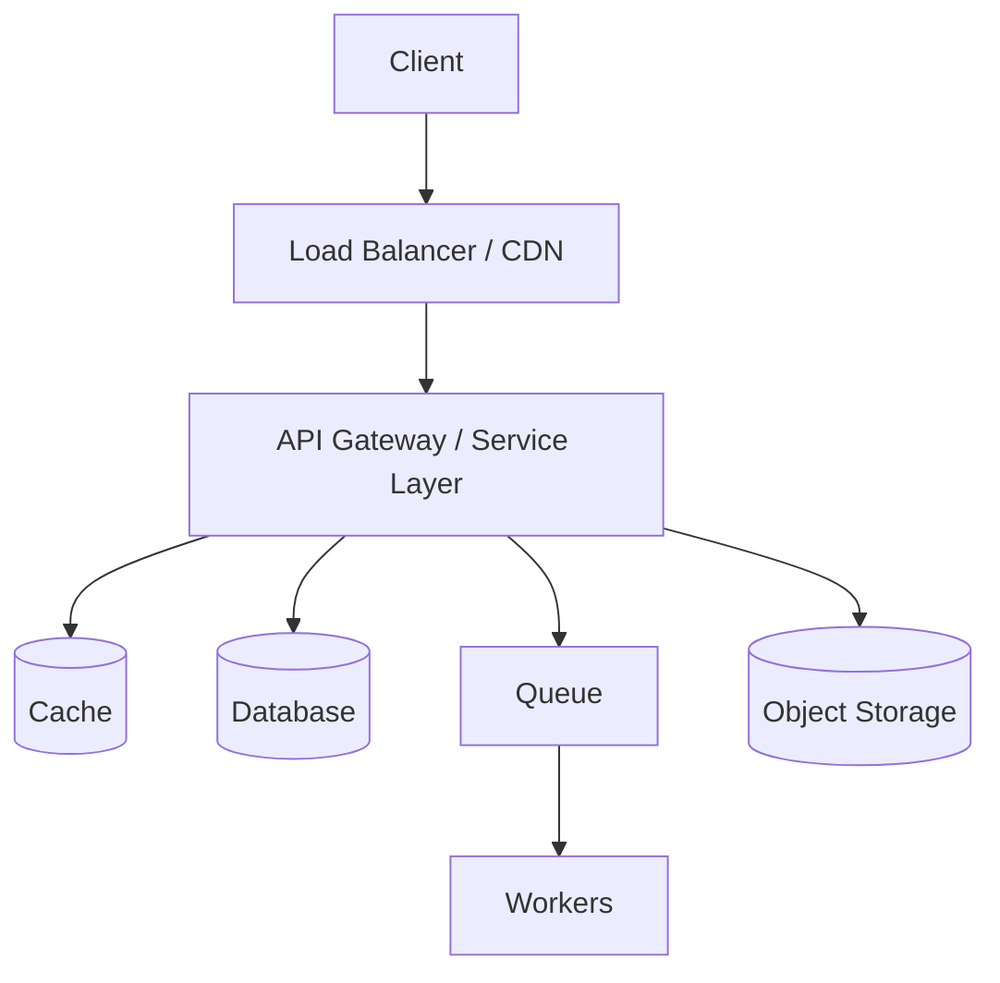

# Template phân tích System Design — «Tên hệ thống»

> Tài liệu này là **khuôn mẫu (template) + hướng dẫn** để phân tích thiết kế hệ thống cho một ứng dụng nhiều tính năng.
> Người/agent viết tài liệu đọc phần hướng dẫn (các dòng bắt đầu bằng `📘 📏 🚫 🎨`) rồi điền vào chỗ `«...»`.
> Các dòng hướng dẫn `📘 📏 🚫 🎨` là **meta-instruction** — có thể xoá khỏi bản phân tích cuối cùng, chỉ giữ lại nội dung đã điền.

---

## PHẦN 0 — Hướng dẫn cho người viết (đọc trước khi bắt đầu)

> Phần này KHÔNG điền. Đây là luật chơi áp dụng cho toàn bộ tài liệu.

### 0.1 Quy trình viết (theo đúng thứ tự, không đảo)

1. **Khám phá tính năng trước.** Quét codebase / mô tả sản phẩm để lập **danh mục tính năng** (mục 1.2). Chưa liệt kê xong tính năng thì chưa phân tích thiết kế.
2. **Phân hạng tính năng** (mục 1.2) → quyết định feature nào phân tích sâu, feature nào viết gọn. Việc này chống cho tài liệu khỏi phình to vô ích.
3. **Điền PHẦN 1 (Tổng quan) đúng một lần.**
4. **Lặp PHẦN 2 cho từng tính năng** theo mức độ đã phân hạng.
5. **Điền PHẦN 3 (Xuyên suốt) đúng một lần.**
6. Điền PHẦN 4 (Phụ lục).

### 0.2 Bốn nguyên tắc xuyên suốt (bắt buộc)

- **Bám ràng buộc (traceability).** Mọi quyết định thiết kế phải truy ngược được về một *yêu cầu* hoặc *con số*. Cấm câu kiểu "dùng Redis cho nhanh" mà không nói nó phục vụ ràng buộc nào. Dùng mã tham chiếu (ví dụ `NFR-CHAT-2`) để nối.
- **Không over-engineer.** Nếu con số ước lượng nhỏ, phải viết thẳng "một DB là đủ, chưa cần shard/queue". Vẽ giải pháp phức tạp cho tải nhỏ là **lỗi**, không phải điểm cộng.
- **Không có bữa trưa miễn phí.** Mỗi lựa chọn phải nêu **cái được và cái mất** (đánh đổi). Giải pháp không kèm đánh đổi là phân tích chưa xong.
- **Không nhảy phần.** Mỗi mục chỉ trả lời đúng câu hỏi của nó. Nội dung thuộc mục khác thì để dành — mỗi mục có ô `🚫 Không viết ở đây` chỉ rõ ranh giới.

### 0.3 Xử lý chỗ chưa biết

Không đoán bừa. Chỗ chưa rõ, đánh dấu `[❓CẦN XÁC NHẬN: ...]` và đi tiếp. Tuyệt đối không bịa số liệu hay hành vi hệ thống.

### 0.4 Quy ước ký hiệu

| Ký hiệu | Ý nghĩa |
|---|---|
| `«...»` | Chỗ cần điền nội dung |
| `[❓CẦN XÁC NHẬN: ...]` | Thông tin còn thiếu, cần người xác nhận |
| `NFR-XXX-n` | Mã một yêu cầu phi chức năng, để tham chiếu chéo |
| ⭐ Core / ● Supporting / · Trivial | Hạng của tính năng |

---

## PHẦN 1 — Tổng quan hệ thống  *(viết MỘT lần)*

### 1.1 Bối cảnh & mục tiêu

> **📘 Mục đích** — Cho người đọc biết hệ thống này là gì, giải quyết vấn đề gì cho ai, trong một đoạn.
> **📏 Độ sâu** — 3–5 câu. Không hơn.
> **🚫 Không viết ở đây** — Danh sách tính năng (→ 1.2); công nghệ dùng (→ 1.5); kiến trúc (→ 1.4).
> **🎨 Trình bày** — Văn xuôi ngắn.

«Mô tả hệ thống, người dùng chính, giá trị cốt lõi.»

### 1.2 Danh mục tính năng & phân hạng (Feature inventory)

> **📘 Mục đích** — Liệt kê TẤT CẢ tính năng và phân hạng để quyết định mức phân tích ở PHẦN 2.
> **📏 Độ sâu** — Một bảng. Mỗi tính năng một dòng, mô tả tối đa một câu.
> **🚫 Không viết ở đây** — Phân tích thiết kế của tính năng (→ PHẦN 2). Ở đây chỉ *đặt tên và phân hạng*.
> **🎨 Trình bày** — Bảng.
>
> **Luật phân hạng** (quyết định độ sâu ở PHẦN 2):
> - ⭐ **Core** — Tính năng lõi, tải cao, hoặc chứa rủi ro (tiền, dữ liệu, realtime, đồng thời). → Phân tích **đủ 8 mục** ở PHẦN 2.
> - ● **Supporting** — Tính năng thường, tải vừa, không rủi ro đặc biệt. → Phân tích **rút gọn** (chỉ mục F.1, F.4, F.5, và F.8 nếu có điểm nóng).
> - · **Trivial** — CRUD đơn giản, tải thấp. → **Một dòng** mô tả, không cần mục riêng.

| # | Tính năng | Hạng | Mô tả một câu | Vì sao xếp hạng này |
|---|---|---|---|---|
| 1 | «...» | ⭐/●/· | «...» | «tải cao? có tiền? realtime?» |

### 1.3 Ràng buộc toàn cục (Global Non-functional Requirements)

> **📘 Mục đích** — Những yêu cầu phi chức năng áp cho *cả hệ thống* (không riêng tính năng nào).
> **📏 Độ sâu** — Bảng ngắn, mỗi thuộc tính một dòng, kèm mã tham chiếu.
> **🚫 Không viết ở đây** — NFR riêng của từng tính năng (→ F.2 của tính năng đó). Cũng KHÔNG viết giải pháp ("dùng cache") — ở đây chỉ nêu *yêu cầu*, không nêu cách làm.
> **🎨 Trình bày** — Bảng.

| Mã | Thuộc tính | Mục tiêu | Ghi chú |
|---|---|---|---|
| NFR-G-1 | Khả dụng (Availability) | «vd 99.9%» | «áp cho toàn hệ» |
| NFR-G-2 | Bảo mật/tuân thủ | «...» | |
| NFR-G-3 | Tỉ lệ đọc/ghi tổng thể | «read-heavy? write-heavy?» | |

### 1.4 Kiến trúc & hạ tầng dùng chung (Shared building blocks)

> **📘 Mục đích** — Vẽ bức tranh tổng thể và liệt kê các khối *dùng chung cho nhiều tính năng* (LB, API gateway, DB, cache, queue, object storage, auth service...). Đây là những khối PHẦN 2 sẽ *tham chiếu lại* thay vì mô tả lặp.
> **📏 Độ sâu** — Một sơ đồ + một bảng liệt kê khối và vai trò.
> **🚫 Không viết ở đây** — Kiến trúc *riêng* của một tính năng (→ F.6). Chi tiết scale (→ F.8 và mục 3.x). Ở đây chỉ mô tả khối *tồn tại* và *phục vụ gì*, chưa mổ sâu.
> **🎨 Trình bày** — Sơ đồ `mermaid` (Claude Code render được) + bảng.

*«Chỉnh sơ đồ theo hệ thống thật.»*

| Khối dùng chung | Công nghệ | Phục vụ ràng buộc/tính năng nào |
|---|---|---|
| «Cache» | «Redis» | «giảm tải đọc cho ..., counter cho ...» |

### 1.5 Tech stack & phụ thuộc ngoài (External dependencies)

> **📘 Mục đích** — Liệt kê công nghệ và **mọi dịch vụ bên thứ ba** (payment gateway, AI provider, email, SMS...). Phần này quan trọng vì phụ thuộc ngoài là nguồn lỗi và bottleneck tiềm tàng, sẽ được nhắc lại ở mục 3.4.
> **📏 Độ sâu** — Hai bảng ngắn.
> **🚫 Không viết ở đây** — Chiến lược chịu lỗi khi phụ thuộc ngoài chết (→ 3.4).
> **🎨 Trình bày** — Bảng.

| Lớp | Công nghệ |
|---|---|
| Backend / Frontend / DB / Hạ tầng | «...» |

| Phụ thuộc ngoài | Dùng cho tính năng | Rủi ro nếu nó chết/chậm |
|---|---|---|
| «Stripe» | «payment» | «không thu được tiền» |

---

## PHẦN 2 — Phân tích từng tính năng  *(LẶP cho mỗi tính năng ⭐ Core; rút gọn cho ● Supporting)*

> **Cách dùng phần này:** Copy khối "TEMPLATE MỘT TÍNH NĂNG" bên dưới cho **mỗi** tính năng Core.
> Với tính năng ● Supporting: chỉ điền F.1, F.4, F.5 (và F.8 nếu có điểm nóng), bỏ phần còn lại.
> Với tính năng · Trivial: đã mô tả một dòng ở 1.2, không cần khối riêng.
> **Nguyên tắc số một của phần này:** phân tích trong phạm vi *một tính năng*. Nếu thấy mình đang thiết kế lại hạ tầng chung → dừng, trỏ về PHẦN 1.

---

### 🔽 TEMPLATE MỘT TÍNH NĂNG — bắt đầu copy từ đây 🔽

## Feature: «Tên tính năng»  `[⭐ Core]`

#### F.1 — Yêu cầu chức năng (Functional Requirements)

> **📘 Mục đích** — Tính năng này *làm được gì*: actor và các hành động lõi. Chốt phạm vi: cái gì trong, cái gì ngoài.
> **📏 Độ sâu** — 3–6 gạch đầu dòng cho hành động lõi + một dòng "Ngoài phạm vi".
> **🚫 Không viết ở đây** — Con số, tải, độ trễ (→ F.2). Cách hiện thực hay công nghệ (→ F.6). Ở đây chỉ có *động từ và luồng*.
> **🎨 Trình bày** — Gạch đầu dòng.

- Actor: «ai dùng»
- Hành động lõi: «đăng ..., xem ..., ...»
- **Ngoài phạm vi (out of scope):** «liệt kê rõ cái cố tình không làm»

#### F.2 — Yêu cầu phi chức năng (Non-functional Requirements)

> **📘 Mục đích** — Tính năng này phải *tốt đến mức nào*. Đây là phần định hình mọi quyết định phía sau.
> **📏 Độ sâu** — Bảng ngắn. Chỉ liệt kê thuộc tính *có ý nghĩa* cho tính năng này; cái nào không quan trọng ghi "thấp/không quan trọng".
> **🚫 Không viết ở đây** — Giải pháp ("dùng Redis"). Ở đây chỉ nêu *yêu cầu*. Số QPS chi tiết để ở F.3.
> **🎨 Trình bày** — Bảng, mỗi dòng một mã `NFR-«FEATURE»-n` để tham chiếu sau.
>
> **Nhắc:** NFR *khác nhau theo từng tính năng*. Đừng bê NFR toàn cục xuống. Ví dụ: sổ coins cần strong consistency + durability cao; lịch sử chat thì eventual là đủ.

| Mã | Thuộc tính | Mục tiêu | Vì sao |
|---|---|---|---|
| NFR-«F»-1 | Nhất quán (Consistency) | «strong / eventual» | «có phải tiền không?» |
| NFR-«F»-2 | Độ trễ (Latency) | «p99 < ? ms / time-to-first-token» | |
| NFR-«F»-3 | Durability | «cao / thấp» | |
| NFR-«F»-4 | Đọc/ghi | «read hay write heavy» | |

#### F.3 — Ước lượng (Estimation)  *(chỉ khi tính năng có tải đáng kể)*

> **📘 Mục đích** — Biến "nhiều người dùng" thành con số dẫn dắt thiết kế: QPS đọc/ghi, dung lượng, và số liệu đặc thù (vd kết nối đồng thời).
> **📏 Độ sâu** — Vài phép tính làm tròn + **kết luận thiết kế** sau mỗi con số. Không tính tới từng byte.
> **🚫 Không viết ở đây** — Cách scale để chịu con số này (→ F.8). Ở đây chỉ *ra số và rút kết luận ngắn*.
> **🎨 Trình bày** — Danh sách "phép tính → kết luận".
>
> **Công thức nhanh:** 1 ngày ≈ 10⁵ giây → *X triệu request/ngày ≈ X×10 QPS trung bình*; QPS đỉnh ≈ ×2–3. Dung lượng = bản ghi/ngày × kích thước × thời gian lưu × 3 (replication).

- Giả định: «vd 1M DAU, mỗi người 20 hành động/ngày» `[❓CẦN XÁC NHẬN nếu không có số thật]`
- QPS ghi: «... → kết luận: một DB đủ / cần shard»
- Dung lượng: «... → kết luận: giữ nóng bao lâu, có tách lạnh không»
- Số liệu đặc thù (nếu có): «vd số SSE/WS đồng thời → kết luận về fleet kết nối»

#### F.4 — Thiết kế API (API Design)

> **📘 Mục đích** — Hợp đồng client–server cho các hành động lõi ở F.1.
> **📏 Độ sâu** — 2–5 endpoint lõi, mỗi cái một dòng: *động từ + đường dẫn + input chính → output chính*. Ghi rõ **kiểu giao tiếp** (REST / SSE / WebSocket / async job).
> **🚫 Không viết ở đây** — Schema bảng (→ F.5). Cách scale endpoint (→ F.8). Không liệt kê mọi endpoint phụ, chỉ cái lõi.
> **🎨 Trình bày** — Danh sách chữ ký API + ghi chú (auth, phân trang cursor, idempotency key ở đâu, mã lỗi chính như 402/429).

- `«VERB» /v1/«...»` — input `«...»` → output `«...»` — kiểu: «REST/SSE/WS/async»
- Ghi chú: «endpoint nào cần idempotency key; phân trang cursor; mã lỗi 402/403/429...»

#### F.5 — Data model

> **📘 Mục đích** — Lưu dữ liệu của tính năng ra sao và **chọn loại lưu trữ (SQL/NoSQL/object storage) + lý do**.
> **📏 Độ sâu** — Các thực thể lõi + khoá chính/khoá truy cập. Với mỗi kho: một câu lý do chọn, nối về NFR ở F.2.
> **🚫 Không viết ở đây** — Sharding, replica, index để scale (→ F.8). Ở đây chỉ *mô hình dữ liệu và lựa chọn kho*, chưa scale. Blob (ảnh/file) → object storage, DB chỉ giữ đường dẫn.
> **🎨 Trình bày** — Bảng thực thể + dòng lý do chọn kho.

| Thực thể | Kho lưu (SQL/NoSQL/S3) | Khoá chính / khoá đọc | Lý do chọn (nối NFR nào) |
|---|---|---|---|
| «...» | «...» | «...» | «cần transaction → SQL / read theo id → NoSQL» |

#### F.6 — Kiến trúc tính năng (Feature architecture)

> **📘 Mục đích** — Ghép luồng của riêng tính năng này: nó **dùng lại khối chung nào** (trỏ về 1.4) và **thêm khối riêng gì** (worker, service riêng...).
> **📏 Độ sâu** — Một sơ đồ nhỏ hoặc mô tả luồng 4–7 bước. Nhấn mạnh chỗ khác biệt so với hạ tầng chung.
> **🚫 Không viết ở đây** — Mổ sâu điểm nóng (→ F.7). Bottleneck/scale (→ F.8). Không vẽ lại toàn bộ hạ tầng chung — chỉ trỏ tên khối.
> **🎨 Trình bày** — `mermaid` nhỏ hoặc luồng đánh số.

«Sơ đồ hoặc luồng: request đi qua khối nào (dùng chung + riêng), theo thứ tự.»

#### F.7 — Đào sâu điểm nóng (Deep dive)  *(Core mới cần)*

> **📘 Mục đích** — Chọn **đúng MỘT** phần khó/rủi ro nhất của tính năng và mổ kỹ theo mạch: *happy path → cái gì vỡ → cách sửa → đánh đổi*.
> **📏 Độ sâu** — Sâu một điểm, không rải đều. Nếu có 2 điểm nóng thì tối đa 2 khối nhỏ, không hơn.
> **🚫 Không viết ở đây** — Những phần "ống nước" chung chung (LB, CRUD). Chọn cái *đặc thù* của tính năng (vd: race condition trừ coins, fanout realtime, idempotency webhook).
> **🎨 Trình bày** — Bốn tiểu mục: Happy path / Cái gì vỡ / Cách xử lý / Đánh đổi.

- **Chọn đào:** «tên điểm nóng — vì sao đây là chỗ rủi ro nhất»
- **Happy path:** «...»
- **Cái gì vỡ:** «đồng thời? provider chết? retry trùng?»
- **Cách xử lý:** «atomic op / idempotency key / pub-sub / circuit breaker...»
- **Đánh đổi:** «được gì, mất gì»

#### F.8 — Nút thắt, mở rộng & chịu lỗi (Bottleneck, scale & failure)

> **📘 Mục đích** — Tính năng này vỡ ở đâu khi *tải tăng* và khi *một thành phần chết*, và cách xử lý.
> **📏 Độ sâu** — Bảng "bottleneck → cách scale → đánh đổi". Thêm mục SPOF và phụ thuộc ngoài nếu có.
> **🚫 Không viết ở đây** — Thiết kế lại từ đầu. Chỉ nói cách *tiến hoá* thiết kế ở F.6. Bám nguyên tắc: cache/replica trước, shard sau cùng; nêu hot-key nếu có counter/khoá dùng chung.
> **🎨 Trình bày** — Bảng + vài gạch đầu dòng chịu lỗi.

| Nút thắt (khi tải ×10) | Cách scale | Đánh đổi |
|---|---|---|
| «đọc? ghi? kết nối? hot key?» | «cache / replica / queue / shard theo «khoá»» | «stale / trễ replica / phá join» |

- **SPOF:** «khối nào chỉ một bản → nhân bản + failover»
- **Chịu lỗi phụ thuộc ngoài:** «circuit breaker / fallback / graceful degradation»

### 🔼 TEMPLATE MỘT TÍNH NĂNG — kết thúc copy tại đây 🔼

---

## PHẦN 3 — Mối quan tâm xuyên suốt  *(viết MỘT lần)*

> Những vấn đề *cắt ngang nhiều tính năng*. Viết ở đây để không lặp trong từng feature.

### 3.1 Xác thực & phân quyền (Auth & authorization)

> **📘 Mục đích** — Cơ chế đăng nhập, token, phân quyền dùng chung.
> **📏 Độ sâu** — Vài câu + luồng token.
> **🚫 Không viết ở đây** — Auth đặc thù của một tính năng (hiếm; nếu có thì ở F.6 của nó).

«...»

### 3.2 Chiến lược nhất quán dữ liệu toàn hệ

> **📘 Mục đích** — Tổng hợp: chỗ nào strong, chỗ nào eventual, và ranh giới transaction xuyên tính năng (vd trừ coins khi gọi một tính năng khác).
> **📏 Độ sâu** — Bảng "vùng dữ liệu → mức nhất quán → vì sao".
> **🚫 Không viết ở đây** — Lặp lại chi tiết từng feature; chỉ tổng hợp bức tranh chung.

«bảng»

### 3.3 Quan sát & vận hành (Observability)

> **📘 Mục đích** — Log, metrics, tracing, alert: đo cái gì để biết hệ thống khoẻ/ốm.
> **📏 Độ sâu** — Danh sách chỉ số vàng cần theo dõi (latency p99, error rate, queue depth, coins mismatch...).
> **🚫 Không viết ở đây** — Chi tiết cấu hình công cụ.

«...»

### 3.4 Phụ thuộc ngoài & chịu lỗi toàn hệ

> **📘 Mục đích** — Tổng hợp từ 1.5: mỗi phụ thuộc ngoài chết thì hệ xử lý ra sao (retry/backoff, circuit breaker, fallback, hàng đợi bù).
> **📏 Độ sâu** — Bảng "phụ thuộc → chiến lược khi lỗi".
> **🚫 Không viết ở đây** — Cách một feature dùng phụ thuộc đó (→ F.6/F.7 của feature).

| Phụ thuộc | Khi chậm/chết thì làm gì |
|---|---|
| «...» | «...» |

### 3.5 Bảo mật & tuân thủ

> **📘 Mục đích** — Mã hoá, bảo vệ dữ liệu nhạy cảm (tiền, PII), rate limit chống lạm dụng, tuân thủ luật.
> **📏 Độ sâu** — Danh sách biện pháp chính.

«...»

---

## PHẦN 4 — Phụ lục

### 4.1 Bảng tổng hợp ước lượng

> Gom mọi con số từ các mục F.3 vào một bảng để nhìn tổng tải hệ thống.

| Tính năng | QPS đọc | QPS ghi | Dung lượng/năm | Ghi chú |
|---|---|---|---|---|

### 4.2 Sơ đồ tổng thể (bản đầy đủ)

> `mermaid` gộp mọi khối chính, nếu cần bản chi tiết hơn 1.4.

### 4.3 Thuật ngữ (Glossary)

> Giải thích các thuật ngữ nội bộ / viết tắt của hệ thống.

---

## Bảng kiểm chất lượng (Claude Code tự soát trước khi kết thúc)

- [ ] Đã liệt kê và phân hạng **hết** tính năng ở 1.2 trước khi phân tích?
- [ ] Mỗi feature Core có đủ 8 mục; Supporting rút gọn đúng quy định?
- [ ] Mọi quyết định thiết kế đều **truy ngược** được về một NFR hoặc con số?
- [ ] Không mục nào lấn sang phần khác (số ở F.3, không ở F.1; scale ở F.8, không ở F.5...)?
- [ ] Mọi lựa chọn đều kèm **đánh đổi**?
- [ ] Không over-engineer: chỗ tải nhỏ có ghi rõ "chưa cần shard/queue"?
- [ ] Chỗ chưa biết đã đánh dấu `[❓CẦN XÁC NHẬN]` thay vì đoán bừa?
- [ ] Đã nêu SPOF và cách xử lý phụ thuộc ngoài?
